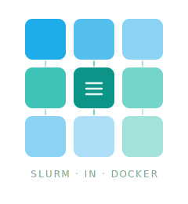

<p align="center">
  
</p>

<p align="center">
  <strong>Create and manage containerized <a href="https://slurm.schedmd.com/">Slurm</a> clusters for development, testing, and CI/CD workflows.</strong>
</p>

<p align="center">
  <a href="https://gsi-hpc.github.io/sind/getting-started/installation/"><strong>🚀 Getting Started</strong></a>&nbsp;&nbsp;&nbsp;&nbsp;<a href="https://gsi-hpc.github.io/sind/"><strong>📖 Documentation</strong></a>
</p>

---

Inspired by [kind](https://kind.sigs.k8s.io/) (Kubernetes in Docker), **sind** offers a familiar CLI experience for quickly spinning up and tearing down Slurm clusters.

## Features

- **Multi-node, multi-cluster & multi-realm** — run controller, submitter, and worker nodes side by side, or spin up multiple clusters across isolated realms with shared networking
- **System containers** — full systemd-based nodes that emulate bare metal, compatible with Ansible, Chef, and other config management tools
- **Cross-cluster networking** — shared mesh network with DNS for multi-cluster setups
- **Worker lifecycle** — dynamically add and remove worker nodes from running clusters
- **Power cycle simulation** — shutdown, reboot, freeze, and power-cycle nodes to simulate real-world failure scenarios
- **Minimal dependencies** — just Docker and a sind container image; usable as both a CLI tool and a Go library

## Quick start

```bash
# Install sind
go install github.com/GSI-HPC/sind/cmd/sind@latest

# Write a minimal cluster config
cat > cluster.yaml <<'EOF'
kind: Cluster
name: dev
nodes:
  - controller
  - worker: 2
EOF

# Create a cluster
sind create cluster --config cluster.yaml

# Check status
sind status

# Delete cluster
sind delete cluster dev
```

## AI disclosure

Parts of this codebase were developed with the assistance of AI tools. All contributions are reviewed by humans.

## License

sind is licensed under the [GNU Lesser General Public License v3.0](LICENSE).

Copyright © GSI Helmholtzzentrum für Schwerionenforschung GmbH
