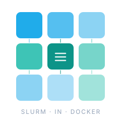

  

  <strong>Create and manage containerized <a href="https://slurm.schedmd.com/">Slurm</a> clusters for development, testing, and CI/CD workflows.</strong>

  <a href="https://gsi-hpc.github.io/sind/getting-started/installation/"><strong>🚀 Getting Started</strong></a>&nbsp;&nbsp;&nbsp;&nbsp;<a href="https://gsi-hpc.github.io/sind/"><strong>📖 Documentation</strong></a>

---

Inspired by [kind](https://kind.sigs.k8s.io/) (Kubernetes in Docker), **sind** offers a familiar CLI experience for quickly spinning up and tearing down Slurm clusters.

## Features

- **Multi-node, multi-cluster & multi-realm** — run controller, database, REST API, submitter, and worker nodes side by side, or spin up multiple clusters across isolated realms with shared networking
- **System containers** — full systemd-based nodes that emulate bare metal, compatible with Ansible, Chef, and other config management tools; [unmanaged clusters](https://gsi-hpc.github.io/sind/guides/unmanaged-cluster/) leave Slurm itself to them
- **Designed for CI/CD** — runs on standard GitHub Actions runners with the runner's Docker daemon, no sudo or privileged containers; [sind-action](https://github.com/GSI-HPC/sind-action) sets up clusters in a single step
- **Multiple Slurm versions** — [official node images](https://gsi-hpc.github.io/sind/container-images/building-images/#official-images) for the supported Slurm release lines (26.05 and 25.11) on linux/amd64 and linux/arm64, each with a full MPI stack, or bring your own image
- **Job accounting, users and identity** — a [db node](https://gsi-hpc.github.io/sind/configuration/node-definitions/#database-node) runs MariaDB and slurmdbd; [users, groups and Slurm accounts](https://gsi-hpc.github.io/sind/guides/users/) with limits, and identity modes from local accounts to nss_slurm and auth/slurm
- **REST API** — slurmrestd on an [api node](https://gsi-hpc.github.io/sind/guides/rest-api/) with JWT authentication (Slurm 26.05)
- **CVMFS** — [mount `/cvmfs`](https://gsi-hpc.github.io/sind/guides/cvmfs/) read-only on every node, from the Docker host or a volume plugin
- **Worker lifecycle** — dynamically add and remove worker nodes from running clusters
- **Power cycle simulation** — shutdown, reboot, freeze, and power-cycle nodes to simulate real-world failure scenarios
- **Minimal dependencies** — just Docker and a sind container image; usable as both a CLI tool and a Go library
- **AI-ready via MCP** — built-in [MCP](https://modelcontextprotocol.io/) server lets AI assistants manage your Slurm clusters

## AI disclosure

This project is developed with the help of AI coding tools. Since September 2026, changes written by Anthropic's Claude Code agent are committed as `Claude <noreply@anthropic.com>` and/or carry a `Co-Authored-By: Claude …` trailer; earlier AI-assisted commits are not individually marked.

## License

sind is licensed under the [GNU Lesser General Public License v3.0](LICENSE).

Copyright © GSI Helmholtzzentrum für Schwerionenforschung GmbH
