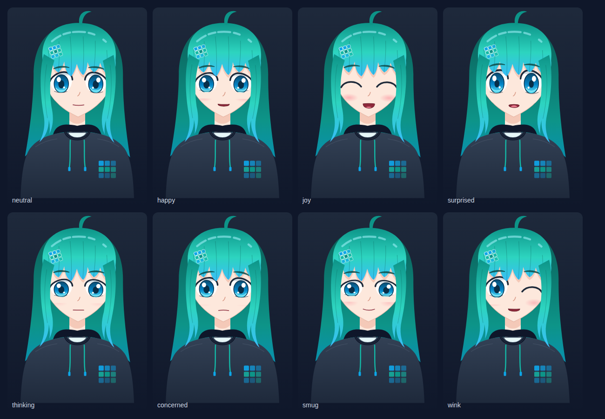

# sind videos with Sindy (feasibility study)

Can coding agents produce tutorial videos for each sind guide, as a screencast
and slideshow hybrid presented by an AI anime avatar, cheaply enough to
re-render whenever the docs change? This directory is the answer so far: **yes,
on a CPU**. It contains a working pipeline, a pilot episode for the
quickstart, its embedding in the docs, and agent skills to make more.



## Pipeline

```text
script.json ──► voice/sindy_voice.py ──► line.wav + line.json (words, visemes, loudness)
                 (Kokoro-82M, CPU)                       │
                                                         ▼
episodes/<id>/     ──  lib/episode.js (scenes: intro, talk, slide, diagram, terminal, outro)
                   ──  lib/scenes.js  (planner, captions, terminal, shots, transitions)
                   ──  lib/sindy.js   (avatar: lip sync, blinks, expressions, gaze, wave)
                                                         │
                                                         ▼
                                   HyperFrames (headless Chrome + FFmpeg) ──► MP4
                                                         │
                                         tools/publish.mjs ──► docs: web MP4, poster,
                                                               WebVTT captions, chapters
```

- **Avatar** (`lib/sindy.js`): a vector anime rig drawn in SVG. Every frame is
  a pure function of time: lip sync from phoneme timings with coarticulation
  smoothing and loudness, seeded blinks and micro-saccades, breathing, head
  sway, hair that lags behind the head, 8 expressions, gaze targets and a wave
  gesture. No WebGL, no clocks, no randomness, so HyperFrames can render frames
  in any order on parallel workers.
- **Voice** (`voice/`): Kokoro-82M (Apache-2.0) through `kokoro-onnx`. The
  upstream ONNX export only returns audio; `setup` exposes the model's
  duration predictor as a second output, which yields exact per-phoneme timings
  for free. Words are phonemized one at a time, so captions get exact word
  times, and `lexicon.json` fixes Slurm terms espeak gets wrong (`squeue`,
  `slurmctld`, `CLI`, …). Presets blend voices and can pitch-shift with
  formants preserved.
- **Scenes** (`lib/scenes.js`, `lib/scenes.css`): a cursor-based planner that
  lays narration lines on the timeline and resolves cue words ("show bullet 2
  when she says *munge*"), karaoke captions, a seekable terminal with typed
  commands and a fast-forward badge, avatar shots (`hero`, `full`, `left`,
  `cornerR`, `cornerL`, `mini`) that Sindy glides between, and iris, push and
  blur transitions.
- **Episode builder** (`lib/episode.js`): an episode is a chain of scene calls
  (see [Writing an episode](#writing-an-episode)); each builds its scene,
  places its narration, moves Sindy and adds the transition.
- **Episodes** (`episodes/<id>/`, one per docs page): the pilot
  `episodes/quickstart/` has an intro with a logo animation and wave,
  fullscreen talk with name tag, slide with corner avatar, two terminal
  screencasts (regular and fullscreen), outro with links and wink, and a fade
  to black.

## Writing an episode

An episode is `script.json` (the narration, one line per id) plus an
`index.html` that chains scene calls. `episodes/quickstart/index.html` is the
reference; copy it to start a new one. Episodes belong to three series, all
listed on the docs' Video Course page (`docs/content/course/`): guide clips at
the top of guide pages, the ten numbered course episodes, and refreshers. The
`sindy-episode` skill gives each series' ids, lengths, pages and titles.

```js
const tl = gsap.timeline({ paused: true });
Episode.create({ tl, id: "quickstart", title: "Quickstart: your first Slurm cluster", series: "Quickstart" })
  .intro({ chapter: "Hi, I'm Sindy", kicker: "Getting started", title: "Quickstart", say: "intro" })
  .talk({ chapter: "What you'll build", title: "…", sub: "…", chips: ["…"], nameTag: {}, say: "welcome" })
  .slide({ chapter: "…", title: "…", say: "what", bullets: [{ icon: "network", title: "…", text: "…", at: "what:network" }] })
  .diagram({ chapter: "…", title: "…", say: "mesh", nodes: [/* … */], groups: [/* … */], edges: [/* … */] })
  .terminal({ chapter: "…", say: ["create", "check"], steps: [{ cmd: "sind create cluster", at: "create:Run" }] })
  .terminal({ wide: true, chapter: "…", say: "nodes", steps: [/* … */] })
  .outro({ chapter: "Wrap-up", next: "…", say: "outro" })
  .done();
window.__timelines["main"] = tl; // in the page, so HyperFrames' lint sees it
```

| Scene | Sindy | Default transition in | Use for |
| --- | --- | --- | --- |
| `intro` | rises in on the right, waves | — | logo sting, episode title, disclosure |
| `talk` | fullscreen on the left | iris after the intro, else push | framing the topic: title card, chips, optional name tag |
| `slide` | corner bubble | push | a title and up to four bullets that land on their cue words |
| `diagram` | corner bubble (or `shot: "mini"` for more room) | push | boxes and arrows: how parts relate, built up on cue words |
| `terminal` | corner bubble | push | commands and output; full-size font up to 62 columns, shrinks to fit 96 |
| `terminal` with `wide: true` | small bubble (or `avatar: "none"`) | push | long lines, e.g. `sind get nodes`: 96 columns at full size, shrinks to fit 160 |
| `outro` | fullscreen on the left, waves, winks | blur | links and the next episode, then fade to black |
| `custom(kind, opts)` | unchanged | push | anything else: returns `{ el, t }` to fill by hand |

Every scene takes `chapter` (listed under the docs player and shown on screen),
`label` (on-screen text if it should differ), `transition`, `shot` and `lead`
(seconds before the narration starts). Terminals fit their font to the longest
line and log a console warning when a line does not fit even at the smallest
size.

**Slide layouts.** `slide` and `diagram` share one frame (`slideFrame()` in
`lib/episode.js`): chapter label, title, Sindy in the corner, narration, and
items that appear just before their cue word (`at`). A new layout, such as a
table or a config file view, builds on the same frame.

**Diagrams.** Nodes sit on a grid over the area below the title: `nodes: [{
id, title, text, icon, pos: [col, row], width, accent, ghost, code, at }]`
(fractional positions are fine; `grid: [cols, rows]` fixes the grid,
`nodeWidth` the default width of 260 px, which fits a title of about 11
characters). `groups: [{ id, label, around: [node ids], accent, at }]` draw a
labelled box around nodes, and `edges: [{ from, to, label, dashed, arrow:
"end" | "both" | "start" | "none", bend, accent, at }]` connect nodes or
groups and draw themselves along their path. `pulse: [{ node, at }]` makes a
node swell and ring once. For anything else, `svg` puts raw SVG into the area,
and `reveal: [{ el: "#selector", at, draw }]` fades its elements in or draws
their strokes. Overlapping nodes or groups, boxes outside the area, and node
text that is cut off show up as warnings in `episode check`.

**Narration and acting.** `say` is a line id, `{ id, mood, cues, look, gap }`
or a list of those. `mood` is the expression for the line, `cues` change it at
a word (`{ running: "joy" }`) and `look` turns her eyes at a word
(`{ complete: 0.35, It: "camera" }`). Slides and terminals make her glance at
their content automatically.

**Times** are written `"line:word"` (the first word in that line starting with
`word`, in the line's latest occurrence), `"line:word#1"` for the second match, `"line:word-0.1"` with an
offset, or plain seconds. Terminal steps take `at` (absolute) or `after`
(seconds after the previous step; a typed command ends when its last character
is typed): `{ cmd }`, `{ out }`, `{ prompt: true }` (a fresh prompt after a
silent command), `{ ff: "⏩ ~40 s later", hold }`, `{ mark: "text", until }`
(highlight), `{ clear: true }`.

## Results

| What | Measured in a 4 vCPU cloud container, no GPU |
| --- | --- |
| TTS | about 3× faster than real time (6.8 s line: 3.4 s including model load) |
| Render | 45 s of 1080p30 in about 1.5 min (software GL, 2 workers) |
| Audio sync | speech onset in the MP4 matches the plan to 10 ms |
| Determinism | frame-difference scan found no glitch frames at worker boundaries |
| Lint | `hyperframes lint`: 0 errors, 0 warnings |

The renders also showed what doesn't work yet:

- Sindy faces front. Head turns are faked with parallax, and the only arm
  motion is the wave.
- Kokoro has no emotion control, and the voice can only be chosen from blends
  of its stock voices.

## Avatar options

| Approach | Anime quality | CPU-only | Seekable | Cost | Notes |
| --- | --- | --- | --- | --- | --- |
| **Code-drawn SVG rig (this)** | medium | yes | pure f(t) | $0 | agent-editable, versioned in git, no art pipeline |
| Layered art (PNGTuber style) | medium–high | yes | pure f(t) | commission | same rig interface, swap the drawing layer for PSD layers |
| Live2D | high | yes (slow) | physics must be re-simulated or pre-rendered | rig $200–3,500 + art | Cubism Core is proprietary; check license for GSI |
| VRM 3D (VRoid + three-vrm) | medium–high | yes (slow) | spring bones must be re-simulated | $0 | free VRoid Studio, generic look unless customized |
| Generative video (HeyGen, Hedra, Kling) | high but drifts | no | no | about $0.03–0.12/s per render | every script edit re-generates; good for a one-off intro |

The rig's interface (visemes `aa/ih/ou/ee/oh/…`, expressions, gaze, gestures)
deliberately matches VRM and Live2D concepts, so the drawing can be upgraded
without changing episode scripts.

## Run it

While developing an episode, render it locally (a laptop or a Claude Code
cloud session); the docs workflow renders the published version.

Requirements: Node.js 22+, Python 3.10 to 3.13, FFmpeg with libx264, and Hugo
0.156 or newer for the docs preview. HyperFrames downloads its own Chrome. If
any of these get in the way, see [Pitfalls](#pitfalls).

```bash
cd video
npm ci
python3.12 -m venv ~/.venvs/sindy          # or: mise exec python@3.12 -- python -m venv ~/.venvs/sindy
. ~/.venvs/sindy/bin/activate              # in every new shell
pip install -r voice/requirements.txt
npm run voice:setup                        # download Kokoro (about 350 MB) and patch it, once
npx hyperframes browser ensure             # download chrome-headless-shell, once

npm run episode -- voice quickstart        # narration into episodes/quickstart/assets/voice/
npm run episode -- check quickstart        # timeline, warnings, lint, stills in episodes/quickstart/snapshots/
npm run episode -- render quickstart       # renders/quickstart.mp4 (add --draft for speed)
npm run voice:samples                      # audition pack in renders/voice-samples/
npm run sheet                              # sindy/sheet.png expression sheet
```

Preview an episode on its docs page:

```bash
npm run episode -- publish quickstart      # docs/static/videos/ and docs/data/videos/ (git-ignored)
cd ../docs
mkdir -p themes/hugo-geekdoc
curl -sL https://github.com/thegeeklab/hugo-geekdoc/releases/latest/download/hugo-geekdoc.tar.gz | tar -xz -C themes/hugo-geekdoc
hugo server                                # http://localhost:1313/sind/getting-started/quickstart/
```

`--all` instead of an episode id processes every episode. `npm run episode --
ci <id> --store <dir>` renders only when the episode's hash changed, exactly as
CI does, and `npm run episode -- hash <id>` prints that hash; it matches CI's
for the same checkout. `npx hyperframes preview` inside an episode opens the
HyperFrames Studio (run `npm run vendor` first), and `npx hyperframes snapshot
--at 5,10` takes stills.

## Layout

```text
video/
  lib/sindy.js          avatar rig
  lib/episode.js        scene builders (an episode is a chain of scene calls)
  lib/scenes.js, .css   planner, captions, terminal, shots, transitions, look
  sindy/                character bible, expression sheet page
  voice/                TTS tool, voice presets, pronunciation lexicon
  episodes/<id>/        one HyperFrames project per docs page (script.json + index.html)
  tools/                episode CLI (voice, check, render, publish, ci), vendoring, screenshots, lip-sync stats
```

Generated files (`vendor/`, `assets/voice/`, `snapshots/`, `renders/`) are not
committed. Renders need no network: GSAP and the fonts come from npm, and the
voice metadata loads from a local script.

## Decisions

- Voice: the `sindy` preset (Kokoro `af_heart` 60% + `af_bella` 40%).
- "sind" is pronounced `/sɪnd/`, like *sinned*, rhyming with Sindy.
- Art: the code-drawn Sindy.
- No background music.
- The pipeline stays in `video/`, next to the docs it follows.
- The docs workflow renders the episodes and the docs site serves them; no
  rendered files are committed. Move to YouTube only if GitHub Pages turns out
  too small.

## Videos in the docs

A guide shows its episode with one shortcode under the page title:

```markdown

```

It renders a 16:9 player with a poster, an English WebVTT caption track
generated from Sindy's word timings, and a row of chapter buttons that jump to
each scene. The docs render has no burned-in captions (`--variables
'{"captions":false}'`), so captions stay toggleable, accessible and
translatable. If an episode was not published into `docs/static/videos/` (for
example a local `hugo server`), the shortcode renders nothing, so writing docs
never needs the video toolchain.

**Deployment.** `.github/workflows/docs.yml` builds `main` (at `/`) and `next`
(at `/next/`) together on every push to either branch that touches `docs/` or
`video/`, and deploys one Pages artifact. No `gh-pages` branch and no deploy
history; pages removed from the docs disappear from the site.

**Rendering in CI.** Before Hugo runs, the workflow calls `episode.mjs ci` for
each branch. Every episode has a hash over its own files and everything shared
that changes its pixels or sound (`lib/`, voice presets, lexicon, tools,
lockfile). Renders live in a store kept in the Actions cache under that hash,
so a docs-only push renders nothing, and changing one episode renders only that
one (about 2-3× real time on a 4 vCPU runner). Changing `lib/` re-renders every
episode, and so does a run after the cache was evicted (7 days unused).
Rendered files are never committed; locally they are git-ignored.

**Size.** The web encode (H.264 CRF 28, `-tune animation`) takes about 4 MB
per minute; the 45-second pilot is 2.7 MB. Ten 3-minute guides are about
120 MB per docs version, well under the 1 GB GitHub Pages site limit. The
100 GB/month soft bandwidth limit allows roughly 8,000 full views a month.

**Fallback.** If Pages turns out too small, upload release episodes to
YouTube and point the shortcode at a privacy-enhanced embed. Note that every
re-render gets a new YouTube video ID.

### One-time switch from the gh-pages branch

Do this in one sitting, right after merging the workflow into `next`:

1. Merge the PR into `next` while Pages still serves `gh-pages`. Its first
   **Deploy docs** run builds both versions; its deploy job most likely fails
   because Pages does not accept Actions deployments yet. The live site is
   unaffected.
2. **Settings → Pages → Build and deployment → Source: GitHub Actions.**
3. **Settings → Environments → `github-pages`**: if deployments are limited to
   selected branches, allow `next` as well as `main`.
4. Re-run the failed deploy job; the build artifact is reused.
5. Check `/sind/` and `/sind/next/`, then delete the `gh-pages` branch.
6. Until the next release, `main` still carries the old peaceiris workflow. If
   docs change on `main` before then, it pushes a new `gh-pages` branch that
   Pages ignores; delete it again, and run **Deploy docs** on `next` to update
   the release docs.

## Pitfalls

Roadblocks met while building this pipeline, and their fixes.

### Local setup

- **Python 3.14**: `pip install` fails with "No matching distribution found
  for kokoro-onnx==0.6.1", because kokoro-onnx supports Python 3.10 to 3.13.
  Create the venv from 3.12, as CI uses.
- **pip refuses the system Python** ("externally-managed-environment", PEP 668,
  e.g. Ubuntu 24.04): use the venv. Activate it in every new shell before
  `episode voice`, `publish` or `ci`, which run `python3`.
- **FFmpeg without libx264**: HyperFrames and the web encode need it; check
  with `ffmpeg -hide_banner -encoders | grep libx264`. Fedora's default
  `ffmpeg-free` lacks it (enable RPM Fusion, then `sudo dnf swap ffmpeg-free
  ffmpeg --allowerasing`), and mise's `ffmpeg` comes from conda and may lack it
  too. Pitch-shifted voice presets also need the `rubberband` filter.
- **`hyperframes doctor` shows ✗** for whisper-cpp, TTS (Kokoro) and MusicGen:
  optional HyperFrames features this pipeline does not use. The Kokoro check
  is about `hyperframes tts`, not `voice/`.
- **Hugo**: distribution packages are often too old for `hugo.Data` (0.156+);
  use a release binary or `mise use -g hugo@latest` (the standard edition is
  enough). `hugo server` needs the geekdoc theme in `docs/themes/` and serves
  under `/sind/`, from the `baseURL`.
- **No video on the local docs page**: the shortcode renders nothing until
  `episode publish` or `episode ci` has written the files. That is intended.

### Claude Code cloud sessions

- No Docker daemon and no GPU: renders use software GL at about 2× real time
  on 4 vCPUs, which is fine for the SVG rig.
- The egress proxy blocks huggingface.co, jsDelivr and unpkg, hosted TTS APIs
  (ElevenLabs, OpenAI), hyperframes.heygen.com, gsi-hpc.github.io,
  api.github.com, docs.github.com and Actions artifact downloads. That is why
  Kokoro comes from the kokoro-onnx GitHub release, GSAP and the fonts from
  npm, and deploys are verified from the Actions job logs instead of the live
  site.
- `npx hyperframes browser ensure` works there; alternatively point
  `HYPERFRAMES_BROWSER_PATH` at the preinstalled
  `/opt/pw-browsers/chromium_headless_shell-*/chrome-linux/headless_shell`.
- Playwright's open-source Chromium cannot decode H.264, so a docs page tested
  there shows a spinner instead of playing the video. Chrome, Firefox, Safari
  and Edge play it.
- The agent cannot listen: voice, pronunciation and pacing need a human ear.

### Authoring episodes

- Nothing may be fetched at render time. HyperFrames' own templates load GSAP
  from jsDelivr; use `vendor/` (`npm run vendor`) and `assets/voice/lines.js`
  instead.
- Outside the HyperFrames runtime `window.__timelines` does not exist, so tools
  that load a composition directly (`tools/publish.mjs`) define it first.
- The root has no `data-duration`: the length comes from the GSAP timeline,
  whose clock tween spans the episode. `<audio>` clips created at setup time
  are mixed into the render, but each needs an `id`.
- Named fonts need an `@font-face` with a local file, or `hyperframes lint`
  complains (`font_family_without_font_face`).
- HyperFrames' lint reads only inline scripts, so each episode page creates the
  paused GSAP timeline, passes it to `Episode.create({ tl })` and registers it
  on `window.__timelines` itself; otherwise lint reports a missing timeline and
  no duration source.
- Never crossfade stacked features with opacity (the eyes looked ghosted);
  squash them shut and swap opaque states instead.
- Lip sync: tune `lipKernel` and `lipGain` with `tools/mouth-stats.mjs`; a
  median opening of about 0.3 reads well.
- Terminal output must match the docs page. When the docs change (e.g.
  `get clusters` gained a db column), update the episode in the same PR.
- Parallel render workers: if a frame flashes at a worker boundary, re-render
  with `--workers 1`. A frame-difference scan of the pilot found none.

### Voice

- The upstream Kokoro ONNX export returns audio only; `setup` exposes the
  duration predictor (`/encoder/Gather_output_0`) as a `duration` output. If a
  new export renames that tensor, `setup` stops with an error naming it.
- espeak misreads Slurm and CLI terms (`squeue`, `slurmctld`, `CLI`) and reads
  a lone "a" as the letter; fix such words in `voice/lexicon.json`. Write
  numbers and commands in the script the way they should be spoken.

### Docs deployment

- The old `gh-pages` deploy kept every build, so videos would have piled up in
  its history; hence the artifact deploy. It needs the Pages source "GitHub
  Actions" and `next` allowed in the `github-pages` environment (see the
  one-time switch above).
- Until the next release, `main` still carries the old peaceiris workflow; a
  docs push to `main` recreates `gh-pages`.
- The Actions cache evicts entries unused for 7 days; the next run then renders
  every episode again.
- GitHub-hosted runners have no FFmpeg and a PEP 668 Python; the workflow
  installs FFmpeg with apt and Python with `actions/setup-python`.
- If an episode fails to render, the deploy fails and the previous site stays
  online.

## Skills

Coding agents make episodes with two skills in `.claude/skills/`:

- `sindy-episode`: from a docs page to a storyboard, `script.json` and
  `index.html`; then voice, check, render, and the shortcode on the page. It
  also covers updating an episode when its page changes.
- `sindy-voice`: speakable narration, pronunciation checks and lexicon
  entries, voicing and presets.

Both rely on two checks an agent can run without eyes or ears:

- `npm run episode -- check <id>` prints the timeline, console warnings (a
  terminal line that does not fit, a cue that matches several words), stale
  or unused narration, and terminal commands or output that are not on the
  episode's docs page, then runs lint and writes two stills per chapter as
  contact sheets.
- `python3 voice/sindy_voice.py phonemes -s episodes/<id>/script.json
  --flagged` shows how words will be pronounced and flags the risky ones.

Ideas for later:

- Real terminal output: record asciinema casts of the documented commands
  against a real cluster and play them back in the terminal scene.
- The HyperFrames skills (`npx hyperframes skills update`) for composition
  rules beyond the episode builder.

## Sources

- HyperFrames: [repository](https://github.com/heygen-com/hyperframes),
  [skills](https://github.com/heygen-com/hyperframes/tree/main/skills)
- Kokoro: [Kokoro-82M](https://huggingface.co/hexgrad/Kokoro-82M),
  [kokoro-onnx](https://github.com/thewh1teagle/kokoro-onnx)
- Lip sync: [Rhubarb Lip Sync](https://github.com/DanielSWolf/rhubarb-lip-sync),
  [VRM 1.0 expressions](https://github.com/vrm-c/vrm-specification/blob/master/specification/VRMC_vrm-1.0/expressions.md),
  [Live2D lip sync](https://docs.live2d.com/en/cubism-sdk-manual/lipsync/)
- Avatars: [three-vrm](https://github.com/pixiv/three-vrm),
  [TalkingHead](https://github.com/met4citizen/TalkingHead),
  [HeadTTS](https://github.com/met4citizen/HeadTTS),
  [Live2D SDK license](https://www.live2d.com/en/sdk/license/),
  [VRoid commercial use](https://vroid.pixiv.help/hc/en-us/articles/4405813333657-Can-I-use-the-models-created-with-VRoid-Studio-Stable-Ver-for-commercial-purposes)
- Generative: [HeyGen Avatar IV](https://www.heygen.com/avatars/avatar-iv),
  [Hedra Character-3](https://www.hedra.com/models/video/hedra/character-3),
  [LivePortrait](https://liveportrait.github.io/)
- Hosted TTS: [ElevenLabs with timestamps](https://elevenlabs.io/docs/api-reference/text-to-speech/convert-with-timestamps),
  [Azure visemes](https://learn.microsoft.com/en-us/azure/ai-services/speech-service/how-to-speech-synthesis-viseme)
- Disclosure: [EU AI Act Art. 50 FAQ](https://digital-strategy.ec.europa.eu/en/faqs/transparency-obligations-under-article-50-ai-act)
